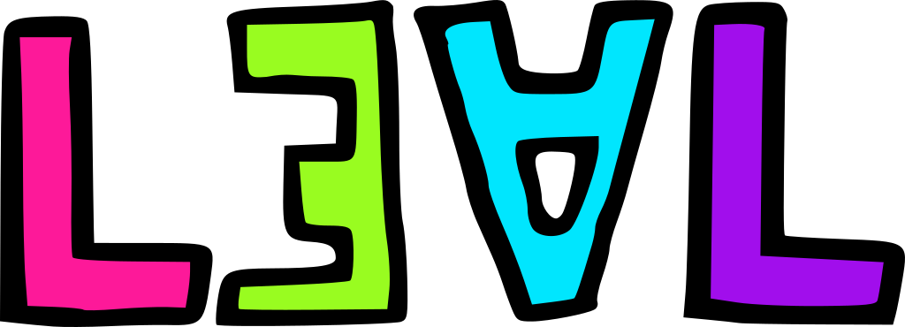

# Licencia Editorial Abierta y Libre (LEAL) | versión 1.3

## Capa legible

### Base de la licencia

#### LEAL

Con LEAL eres libre de usar, copiar, reeditar, modificar, distribuir
o comercializar bajo las siguientes condiciones:

* Los productos derivados o modificados han de heredar algún tipo de LEAL.
* Los archivos editables y finales habrán de ser de acceso público.
* El contenido no puede implicar difamación, explotación o vigilancia.

### Coletillas de la licencia

Las coletillas son condiciones adicionales que pueden agregarse a la
licencia LEAL.

Para distinguirlas de la base de la licencia se agrega un guion antes de las
coletillas, por ejemplo: LEAL-A, LEAL-O o LEAL-AO. En la medida de lo posible
agréguense las coletillas en orden alfabético, por ejemplo: LEAL-AO es
preferible sobre LEAL-OA.

#### A: Atribución

La coletilla «A» añade la siguiente condición:

* La atribución de los colaboradores de la edición previa es obligatoria.

#### O: Otra nomenclatura

La coletilla «O» añade la siguiente condición:

* Los productos derivados o modificados han de tener distinto nombre.

## Capa discursiva

Para las versiones cero de la LEAL se redactaron los motivos por los cuales
se constituye esta licencia de uso. Estos pueden consultarse en el commit
1a862556 de este repositorio o [dando clic aquí](https://gitlab.com/NikaZhenya/licencia-editorial-abierta-y-libre/blob/1a862556c7938033477ba603cffa70d3695902d4/README.md).

Para las versiones uno aún está pendiente la redacción de motivos. Existen dos
principales cambios entre las versiones cero y uno:

1. Todas las LEAL ahora son [_copyfarleft_](https://endefensadelsl.org/manifiesto_telecomunista.html).
2. Se añadió una nueva cláusula que impide el uso para vigilancia.
3. Ya no hay varios tipos de licencia sino una sola a la que pueden agregarse
   más condiciones.

## Capa legal

Nunca ha existido la redacción de las LEAL en lenguaje jurídico. La tarea
sigue pendiente.

---

# Discusión y colaboración

Apóyanos a mejorar esta licencia, escríbenos a [hi@cliteratu.re](mailto:hi@cliteratu.re) o al perro en [hi@perrotuerto.blog](mailto:hi@perrotuerto.blog).
